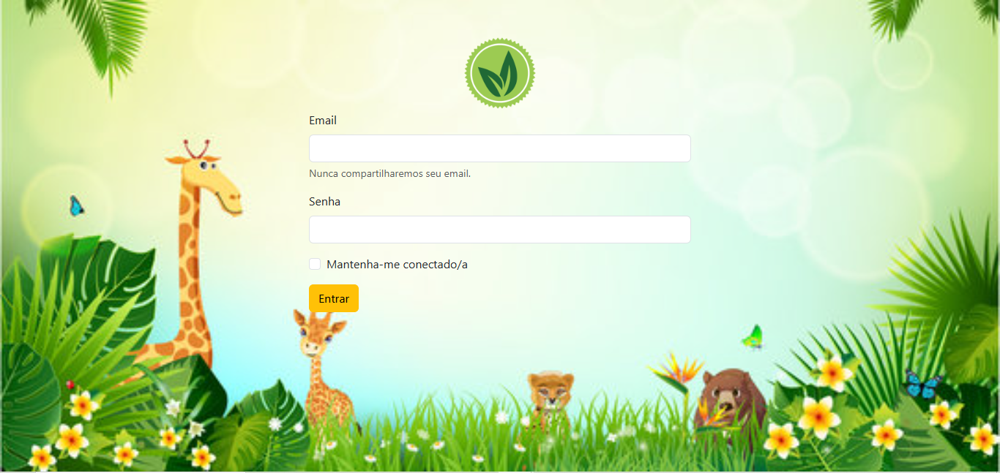
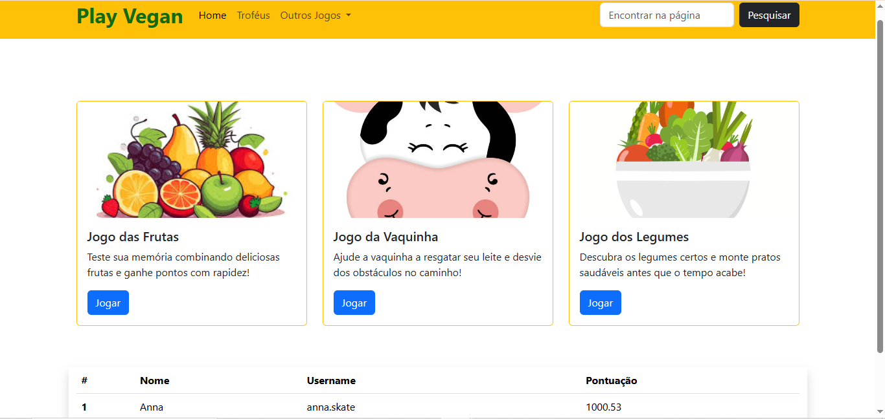

# Play Vegan

Um site simples e divertido com mini-jogos educativos voltados para o tema veganismo.  
O projeto inclui uma página de login e uma página inicial com cards de jogos, tabela de pontuações e layout responsivo utilizando **Bootstrap 5**.

---

## 🧩 Páginas

### Página de Login (`index.html`)
- Fundo com imagem temática.
- Logo centralizado.
- Formulário responsivo (email, senha e checkbox).
- Botão que redireciona para `home.html`.

### Página Inicial (`home.html`)
- Navbar com menu e campo de busca.
- Cards de três jogos:
  - Jogo das Frutas
  - Jogo da Vaquinha
  - Jogo dos Legumes
- Tabela de ranking utilizando Bootstrap.

---

## 🎨 Estilos (style.css)

O projeto utiliza:
- Imagem de fundo com `background-size: cover`;
- Ajustes responsivos da logo;
- Imagens dos cards com `object-fit: cover`;
- Detalhes personalizados da navbar.

---

## 🚀 Tecnologias Utilizadas

- HTML5  
- CSS3  
- Bootstrap 5  

---

## 📸 Imagens do site

